  

 

## ┌── about ──┐

> Software Engineering student from Faisalabad 🇵🇰 — MERN Stack Developer working across frontend & backend, with a growing interest in AI and a real fondness for game development.
>
> I believe in **building in public** — sharing every step of the journey: the progress, the bugs, and the little wins.

 

## ┌── what i'm up to ──┐

<table>
<tr><td width="140"><b>🖥️ what I do</b></td><td>Full-stack (MERN) development — frontend &amp; backend, with an eye toward game systems</td></tr>
<tr><td><b>🎓 studying</b></td><td>BSSE, University of Faisalabad — CGPA ~3.8/4.0</td></tr>
<tr><td><b>🕹️ currently building</b></td><td>Browser-native multiplayer game systems (Three.js, Colyseus, Rust/WASM) with AI-driven NPCs</td></tr>
<tr><td><b>🌱 community</b></td><td>Founder, <a href="#">Cloud Practitioners Studio</a> — 20+ members · Microsoft Learn Student Ambassador (Community Influencer path)</td></tr>
<tr><td><b>🏆 open source</b></td><td>Active across ECSoC'26</td></tr>
<tr><td><b>🎯 2026 goal</b></td><td>Ship 10+ public projects · AWS Certified Cloud Practitioner (targeting October)</td></tr>
<tr><td><b>💬 ask me about</b></td><td>Web dev, DSA/OOP in C++, open-source contribution, or starting your coding journey</td></tr>
</table>

 

## ┌── currently shipping ──┐

- 🛵 **Interactive 3D Portfolio** — React + TypeScript + Three.js, with a scooter-riding game mode (Asphalt-style camera, combo system, landmark navigation)
- 🎮 **How Ball** — 3D endless runner (Next.js 15, React Three Fiber, Zustand) — [live](https://how-ball.vercel.app)
- 🗣️ **Awaaznama (آوازنامہ)** — bilingual Urdu voice-to-form web app (React/Vite, Whisper API, LLM field extraction)
- 📊 **CRM Dashboard** — optimization pass, Aug 2026 [live](https://client-cyan-rho.vercel.app)
- 🔧 **Open source** — merged PRs across WorkSphere, CampusConnect, and linkid as an active contributor

 

## ┌── community & leadership ──┐

- 🌍 Founded **Cloud Practitioners Studio**, a 20+ member community built as a stepping stone toward GDG collaboration
- 🎤 Part of **DEV WEEKEND**, a 3-day virtual bootcamp, and active member of the **Upskill Summer Series** (Atom Camp × GDG)
- 🏅 **Microsoft Learn Student Ambassador** — Community Influencer path
- 🧑‍💻 Contributor across  **ECSoC'26**

 

## ┌── contribution snake ──┐

<picture>
  <source media="(prefers-color-scheme: dark)" srcset="https://raw.githubusercontent.com/zainabhina05-png/zainabhina05-png/output/github-contribution-grid-snake-dark.svg">
  <source media="(prefers-color-scheme: light)" srcset="https://raw.githubusercontent.com/zainabhina05-png/zainabhina05-png/output/github-contribution-grid-snake.svg">
  
</picture>

 

## ┌── streak ──┐

  

 

## ┌── top languages ──┐

  

 

## ┌── stats & activity ──┐

 
 
   

 

 

## ┌── tech stack ──┐

**Languages &amp; Fundamentals**

**Frontend**

**3D &amp; Animation**

**Backend**

**Database**

**Testing &amp; Tooling**

**Game Dev**

**Tools &amp; Practices**

 

## ┌── let's connect ──┐

 

Check back often — I'm always learning and shipping something new.

